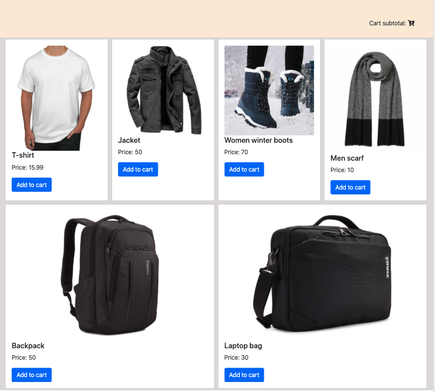

# Mini 'Online shop' Exercise

# Part 1 of 3 - Displaying the card items

For this part of the exercise I'd like you to build the following layout using just 'vanilla' JavaScript, HTML and CSS:



Note that:

- The app.js file contains several methods with comments in them instructing you on what needs to be done.

- To work on this exercise you need to download this folder as zip and import it into the coding editor of your choice.

- CSS file contains the required classes to style the layout as per the preview above.

Your task is the following:

- Use a for loop in the `loadItems()` method in app.js to render the cards for each item in the array of items.
- Use bootstrap classes (by using the `element.classList.add()` method to add a class to a specific element) to style the cards accordingly.
- Here is how a single bootstrap card would look like:

```
 <div class="card" style="width: 18rem;">
   
   <div class="card-body">
     <h5 class="card-title">Card title</h5>
     <p class="card-text">Price goes here</p>
     <a href="#" class="btn btn-primary">Go somewhere</a>
   </div>
 </div>
```
